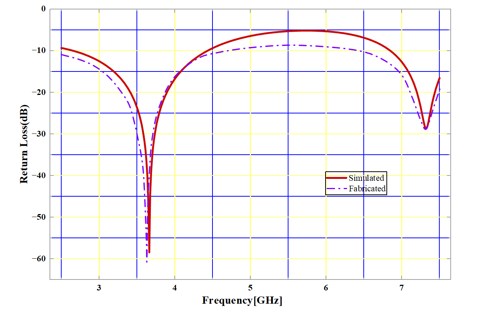
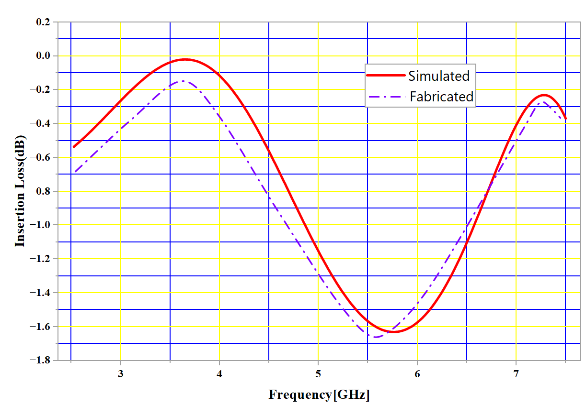
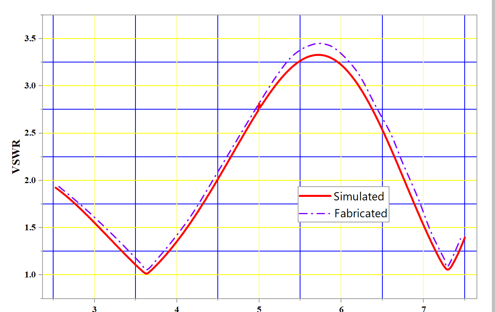
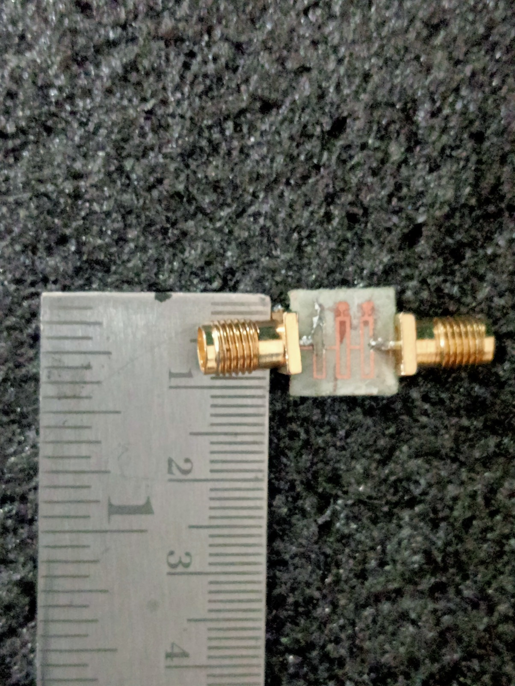
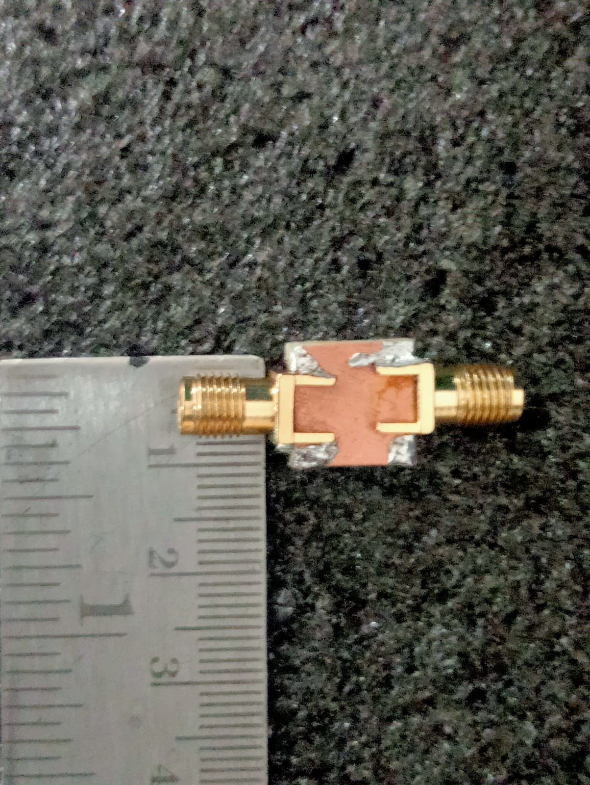

# Microstrip Band Pass Filter (BPF)

## 📌 Project Overview
This project focuses on the design and fabrication of a Microstrip Band Pass Filter using HFSS software and experimental validation using a Vector Network Analyzer (VNA).

## 🎯 Objective
To design a band pass filter that allows signals within a specific frequency range while rejecting others.

## 🛠️ Tools & Technologies Used
- HFSS (High Frequency Structure Simulator)
- VNA (Vector Network Analyzer)
- Microstrip Technology

## 📊 Results

### S11 (Return Loss)
Shows how much signal is reflected back.

### S21 (Insertion Loss)
Shows how much signal is transmitted through the filter.

### VSWR
Indicates impedance matching of the system.

## 📷 Results Visualization

### S11 Graph

### S21 Graph

### VSWR

### Prototype - Frontend

### Prototype - Backend

## 🧪 Fabrication
The filter is fabricated on a dielectric substrate and tested using VNA.

## 📁 Files Included
- Abstract
- Fabrication Procedure
- Report
- PPT Presentation
- HFSS Design File (.aedt)
- S11, S21 Graphs
- Prototype Images

## 🚀 Applications
- Wireless communication systems
- RF and microwave circuits
- Signal processing systems

## 👨‍💻 Author
Swaroop Makina
